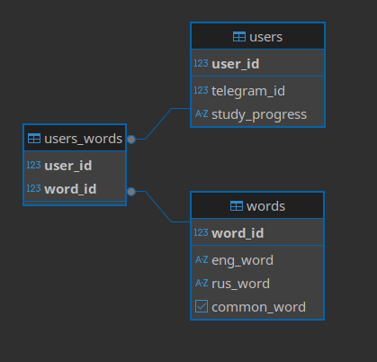

# ***Telegram-бот для изучения английского языка***

Telegram-бот для изучения и повторения английских слов.  
Пользователи могут добавлять, удалять и изучать слова в своём личном словаре.  
Программа использует базу данных PostgreSQL для хранения данных о пользователях и их словах.

---

## Возможности

- 📚 **Изучение слов** — бот показывает случайные слова с вариантами перевода.  
- ➕ **Добавление слов** — пользователь может добавлять свои слова и переводы.  
- 🔙 **Удаление слов** — можно удалить отдельное слово или очистить весь словарь.  
- 👤 **Персонализация** — у каждого пользователя своя база слов.  
- 💾 **Работа с БД** — данные сохраняются в базе через SQLAlchemy.  
- 📊 **Прогресс** — бот отслеживает, какие слова пользователь уже изучил, и показывает новые.

---

## Структура проекта

```
project/
│
├── app/
│   ├── database/
│   │   ├── db.py             # Подключение и сессии БД
│   │   ├── models.py         # Таблицы: Users, Words, Users_words
│   │   ├── config.py         # Настройки БД и Telegram токена
│   │   └── init_db.py        # Инициализация БД
│   │    
│   ├── keyboards/
│   │   ├── main_menu.py      # Главное меню Telegram-бота
│   │   └── study_keyboard.py # Клавиатура для изучения слов
│   │
│   ├── services/
│   │   ├── user_service.py   # Работа с пользователями
│   │   ├── word_service.py   # Добавление/удаление слов
│   │   └── study_service.py  # Логика изучения слов
│   │
│   ├── handlers/
│   │   ├── start_handler.py        # Команды /start и /help
│   │   ├── add_word_handler.py     # Добавление слов
│   │   ├── delete_word_handler.py  # Удаление слов
│       └── study_handler.py        # Изучение слов
│      
├── main.py             # Точка входа — запуск бота
├── requirements.txt    # Зависимости
├── README.md           # Документация проекта
└── .gitignore
```

---

## Структура базы данных

**База данных содержит три таблицы:**
1. **users** — пользователи Telegram
2. **words** — английские слова (базовые и пользовательские)
3. **users_words** — связи пользователей с их словами (many-to-many)  

**Схема базы данных:**



---

##  Установка и запуск

### 1. Клонируйте репозиторий
```bash
git clone https://github.com/Alex-virtus/Learning-English-Bot.git
cd Learning-English-Bot
```

### 2. Создайте и активируйте виртуальное окружение
```bash
python -m venv venv
source venv/bin/activate   # Linux / macOS
venv\Scripts\activate      # Windows
```

### 3. Установите зависимости
```bash
pip install -r requirements.txt
```

### 4. Настройте переменные окружения
Создайте файл `.env` и добавьте:
```
TG_TOKEN=ваш_токен_бота
DB_USER=имя_сервера
DB_PASSWORD=пароль_сервера
DB_HOST=адрес_сервера
DB_PORT=порт_БД 
DB_NAME=имя_базы_данных
```

### 5. Запустите бота
```bash
python main.py
```

---

## Команды бота

| Команда | Описание |
|----------|-----------|
| `/start` | Запуск и приветственное сообщение |
| `/help` | Список доступных команд |
| 🎯 **Изучать слова** | Начало тренировки |
| ➕ **Добавить слово** | Добавление нового слова |
| 🔙 **Удалить слово** | Удаление слова или всего словаря |

---

## Пример работы

```
👋 Привет! Давай попрактикуемся в английском языке.

Ты можешь изучать слова в своём темпе и собирать базу слов.

📚 Используй кнопки:
• Изучать слова 🎯
• Добавить слово ➕
• Удалить слово 🔙
```

---

##  Используемые инструменты

- Python 3.10+
- IDE(PyСharm)
- PyTelegramBotAPI
- SQLAlchemy
- PostgreSQL
- python-dotenv
